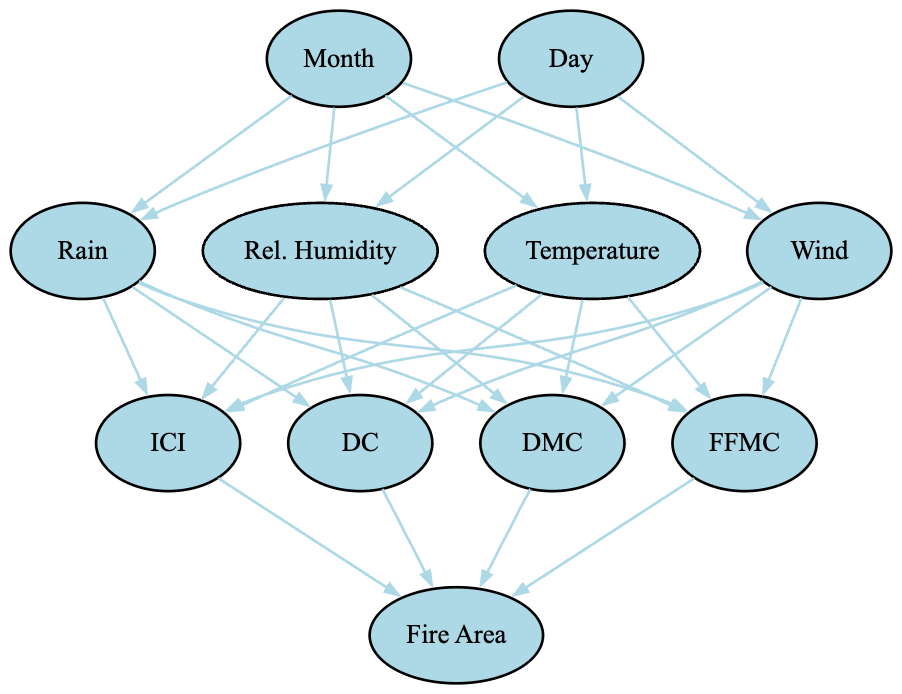

# Data Summary

Implementation of a probabilistic agent to predict fires based on data given from https://archive.ics.uci.edu/dataset/162/forest+fires  

Our data maps out Montesinho park, a region in North Eastern Portugal on an X,Y spatial coordinate grid. Everyday, for each coordinate on the map, the following metrics are measured
* `Temperature`
* `Wind`
* `Rain`
* `Relative Humidity`
* `Month`
* `Day`

UPDATE: Brief overview of our data
* Fire Weather Index Metrics
  * `FFMC` (Continuous): Measures moisture content of litter and other fine fuels, higher --> fuels ignite/burn easier
  * `DMC` (Integer): Measures moisture content of loosely compacted organic material in the forest, higher --> material ignites/burns easier
  * `DC` (Continuous): Measuress moisture content of forest fuels, higher --> dryer/more risk
  * `ISI` (Continuous): Initial Spread Index, measures how fast a fire may spread once ignited
* Total burned area

As noted on the website from which the dataset was pulled from, given that the output skews towards 0.0, a logarithmic transformation is recommended. The attached research paper applied a transformation of $f(x) = ln(x+1)$.
Summary and Goal of our proposed agent: Given that we are able to observe the state of the forest (i.e. the aforementioned metrics) for everyday recorded, our goal is to predict the area burned of the forest for the following day. That is to say that our agent aims to predict the area that will burn on a subsequent day, given the metrics currently available to it.

# Broad Details of our probabilistic model agent
What kind of probabilistic model is it? 
* The world the AI agent exists in and will be trained in will be the Northeast region of Portugal.
  * The Performance measure of our agent will be the probability at which it correctly or closely correctly determines the occurrence and spread of wildfires given the metric available to it.
  * The Environment the agent exists in will be the Montesinho park, a national park in Northeast Portugal
  * The Actuators available to this agent will be capable of output predictions of the fires. A proposed output would be something similar to the inputs given to the agent; a vector which contains a predicted coordinate for the area burnt, alongside predicted weather metrics for iterative predictions (i.e. predicting multiple days in advance)
  * The Sensors available to this agent will be the measurements provided. Our agent in practice will be able to have access to the aforementioned metrics given, such as temperature, humidity etc.

What kind of agent is it? Goal based? Utility based? etc. 
 * Given our goals and data available, we believe it is most appropriate to utilize a goal-based agent, given our emphasis on predicting future events given the partially observable knowledge of its dynamic environment.

Describe how your agent is set up and where it fits in probabilistic modeling
* Many of our variables, such as FFMC, DMC, humidity, and wind speed, are continuous, so we indexed them to make them compatible with our probabilistic model. We structured these continuous variables into predefined bins that allowed us to compute probabilities more effectively.

# Initial Belief Network
We based our conditional probability table computations and our model off of the constructed belief network. The dependencies of the nodes to one another are based off of a combination of our own intuition and how certain variables (like the weather indexes) are calculated.

  

# Data Exploration
First we thought it would be helpful to look at the distributions of each of our index variables (different fire indexes that assess risk).

\
As you can see, although many of these models draw from the same metrics (wind, humidity, temperature, precipitation), they're distributed quite differently. This tells us they may each give us unique insights as to the risk of fire that day.\
From what we've researched, we know that a high FFMC means litter and other cured fine fuels are more likely to ignite, so our data heavily observes instances where risk of ignition is high. DMC assesses the dryness and risk of ignition of loosely compacted organic layers, but this index is more widely distributed. DC measures deep, compacted organic layers, again with higher values being dryer/greater risk. This has a left skew and we observed more values on the higher end of the scale. Finally, ISI (Initial Spread Index) measures how fast a fire may spread once ignited. These values are skewed right and grouped towards the lower end of the scale. Since each of these indexes measure different sources of ignition/spread that can affect the occurrrence/spread of a fire, they are all incredibly helpful when it comes to predicting a fire.
  

\
Another interesting aspect of our data is the observation frequency of fires in general and what months are more prevalent in our data. As you can see, the occurence of fire vs. no fire is about equal. Meanwhile, for the months represented, we see August and September have a much higher frequency than other months. We assume this to be because August and September are peak fire seasons, so collecting fire-related data is more crucial during these periods.
  
\
For missingness we've determined that no column in our data has missing values that need to be addressed, making it easier to train our model.

MS3 Update: For data pre-processing, we separated the variables of FFMC, DMC, DC, and ISI into five distinct ranges, with each range assigned to a number between 0 and 4. The lower the number, the less severe the variable was. For example, if our FFMC were between 50 and 80, it would have been categorized as a severity level 1. This process was done across all entries as it allowed us to turn continuous data into discrete data, which made it easier for us to work with it. The ranges we used were obtained from category ranges defined by the Department of Agriculture of Ireland and Resource Watch, an organization partnered with the United Nations Development program that tracks and reports metrics such as FFMC, DMC, DC, and ISI. We further separated our data into two ranges: low severity and high severity. When a variable was designated a severity score of an inclusive range between 0 and 2, we classified it as a low-severity variable. In contrast, variables with a severity score of 3 or 4 were designated as high-severity variables.

# MS2 Update: First Iteration of Training
Our first iteration of training we used in milestone 2 was a Naive Bayes approach.
In the 7th cell of the agent_playground jupyter notebook, we calculated the conditional probability
for the variables of FFMC, DMC, DC, and ISI given if an area was burned or not. After calculating and storing our conditional probability, we demonstrated in cell 9
that we are able to calculate and show a requested entry in a CPT table for the defined variables.

For our next approach towards training, we believe it is more appropriate to utilize a learning algorithm such as the
EM algorithm as we are attempting to find the probability of an event occuring as we are given more and more information
over time.

# MS3 Update: Second Iteration of Training
Because our data is complete, we used Maximum Likelihood instead of the traditional EM Algorithm for our EM updates. This makes sense because, in conventional EM, we compute the expected value of the missing data based on the observed data and current parameter estimates. With no missing data, this is unnecessary, and we can explicitly write the likelihood function and maximize it. This allows us to generate a more accurate CPT of our data. This effectively allows us to initialize and prepare our CPT for future observations. 

In cell 30 of agent_playground.ipynb, we demonstrate our data pre-processing method that imports our data set, converting all continuous variables into discrete variables based on the range they fall under.

In cell 29, we demonstrate that our maximum likelihood function can calculate the likelihood of the conditional probability of a fire occurring given a range for each of the 4 variables.

As our model aims to become more accurate as it accrues more data, each new day (entry) can be interpreted as the i-th + 1 observation, by which, in a further iteration of our model,  we could then update the CPT. A possible area of maximizing efficiency in such an approach would be to store significant counts, such as the number of observations in which a variable falls under a specific severity or range. In an ith + 1 iteration, we would only need to update the counts for which the observation's variables fall under. For example, if our observation contains an instance of a DMC variable falling under the severity score of 2, we would increment the number of counts of DMC variables with a severity score of 2. In such an approach, instead of parsing our data each time we desired to calculate a Maximum Likelihood, we could instead calculate it using our already initialized counts.

# Conclusion
Our first probabilistic model effectively identifies important trends in fire occurrence depending on environmental conditions. The analysis shows that FFMC plays a significant role, and levels between 85 and 95 significantly increase the likelihood of a fire. The highest likelihood of fire occurs within the range of 90 ≤ FFMC < 95, where 74.44% of observations indicate fire presence. Similarly, DMC demonstrates a strong correlation with fire occurrence, with fire probability rising as DMC increases. The highest probability (88.89%) is observed for DMC values greater than 200. 
Our findings are further supported by seasonal trends, since fire incidents peak in August and September, which corresponds with the region's dry season. Additionally, the dataset is well-balanced between fire and no-fire cases.
  

  
### Comparing Models
Since our data is abundant and complete, we used Maximum Likelihood for EM updates to improve the accuracy of our model. This is different than our Milestone 2 model which only relies on Naive Bayes'.

TO DO:
* Train your first model
* Evaluate your model
* Create/Update your README.md to include your new work and updates you have all added. Make sure to upload all code and notebooks. 
* Provide links in your README.md
Conclusion section: What is the conclusion of your 1st model? What can be done to possibly improve it?
